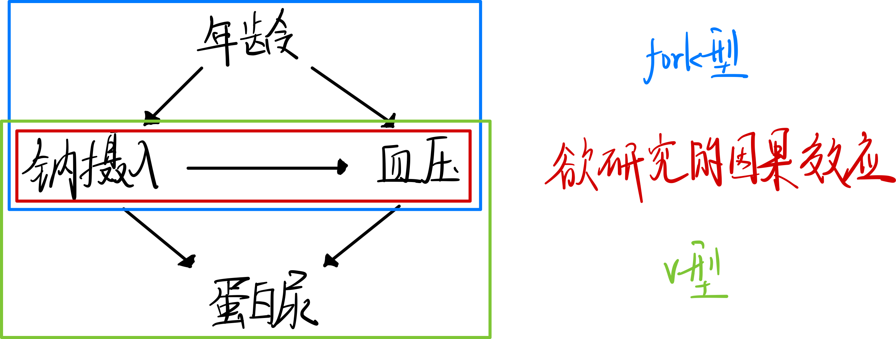

# 因果推理

假设你有一些观测数据集，你作为行业专家，把这些变量之间的因果结构图进行了绘制(假设)如下：

那么应该如何计算钠摄入到血压的平均因果效应(ATE)呢？

- 直接计算钠摄入到血压的ATE，即 $X=\{\emptyset\}$
- 控制年龄，即 $X=\{age\}$
- 控制蛋白尿，即 $X=\{age,proteinuria\}$

答案是 **控制年龄** ，因为在这个因果图当中仅有年龄是混杂因子(confounder)， **fork结构** 有错误的关联， **v结构** 没有关联，若强控制蛋白尿，则反而会产生错误关联。

---

我目前认为 **先验知识** 很重要，否则无法建立上面的 **因果图** ，进而无法计算正确的 **ATE** 。

